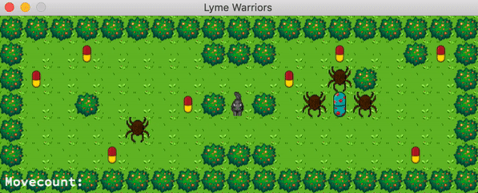
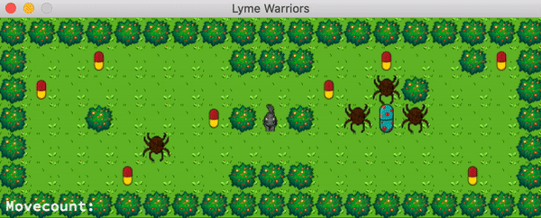

# About So_Long 

So_Long is the first graphical project I have made during my 42 Network curriculum.
It's a 2D game that's made with minilibx where we use textures, sprites, tiles and linked lists.
I succeeded with 125/100 points.

## Theme - Lyme Disease 

The game uses Lyme disease as an educational theme, with ticks, antibiotics, and infection-inspired mechanics.
The player must collect antibiotics while avoiding ticks. Once all required items have been collected, the player can reach the exit and complete the level.
This project combines a simple game concept with the technical challenges of building a graphical application from scratch, including map parsing, rendering, player movement, collision detection, and game-state management.

## Game Visuals

**Winning**



**Losing**



## Installation :desktop_computer:

To play this game yourself, please follow the next steps:

1.  Compile the game with the following command:
```
$ make
```
2. Execute the game with the following command, and choose your map:
```
> $ ./so_long maps/valid/map2.ber
````
You can use your arrow or WASD keys.

Have fun!
