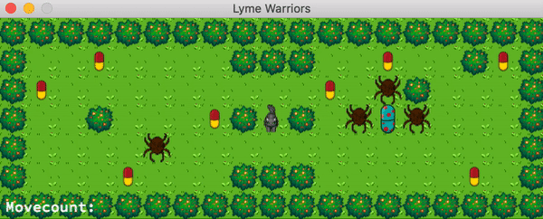

# About So_Long 

So_Long is the first graphical project I have made during my 42 Network curriculum.
It's a 2D game that's made with minilibx where we use textures, sprites, tiles and linked lists.
I succeeded with 125/100 points.

## Theme: Lyme Disease 
Inspired by my personal experience with Lyme Disease, I've chosen it as the theme for my game.
Not just to raise awareness for Lyme, but it was definitely also a way for me to process my journey.

Players have been in contact with a tick and need to collect antibiotics to prevent this infectious disease.
Make sure to avoid the other ticks, because they'll give you a bullseye rash - it indicates a certain infection!
Treatment can include two kinds of antibiotics, so exit through the other antibiotic to make sure you can beat Lyme to the curb!

## Game Visuals

**Winning**



**Losing**


## Installation :desktop_computer:

To play this game yourself, please follow the next steps:

1.  Compile the game with the following command:
```
$ make
```
2. Execute the game with the following command, and choose your map:
```
> $ ./so_long maps/valid/map2.ber
````
You can use your arrow or WASD keys.

Have fun!
